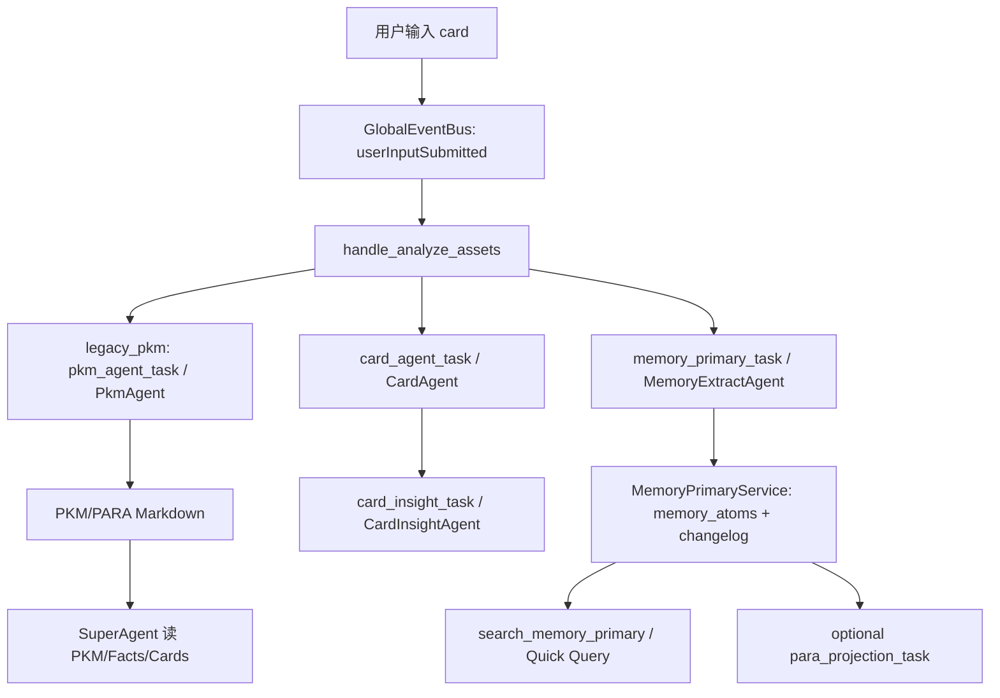

# PR256 Agent 评估技术报告：Memory Primary v12 新链路 vs legacy_pkm 老链路

生成时间：2026-06-15

## 结论

本轮按 `memex-lab/memex#256` 的 Agent 指标体系，在同一套大样本合成数据上完成新旧链路对比：8 个 persona，每个 persona 400 条输入，共 3200 条 record，并覆盖 memory recall、PARA projection、Super Agent ask、原始 LLM-as-judge 与补充 judge 指标。

结论分两层：

1. **实验 feature 开关可以推进**：Memory Primary v12 在 deterministic 大样本 gate 上通过，老链路失败；新链路在任务结算、卡片完成、Memory 写入/召回、Super Agent 命中、成本和延迟上明显优于老链路。产品形态建议为 `legacy_pkm` / `memory_primary` 二选一开关，切换时全量刷新数据，PARA projection 作为可选手动/定期工具。
2. **#256 指标 blocker 已关闭**：原始 PR256 judge 暴露的 Quick Query grounding 问题已按 case 修复，并用同一批大样本 case log 的 32 个 Super Agent ask / 64 个 judge task 复跑通过：`unsupported_claim_absence=32/32`，`grounded_answer_rate=32/32`。因此当前结论是：可以进入实验开关和灰度；默认全量切换建议在真实用户灰度日志稳定后推进。

老链路在本轮中保持冻结；所有代码修复只作用于新链路或评估基础设施。

## 链路差异

| 维度 | 老链路 `legacy_pkm` | 新链路 `memory_primary` |
| --- | --- | --- |
| 输入后主链路 | `analyze_assets -> card_agent_task -> pkm_agent_task` | `analyze_assets -> card_agent_task + memory_primary_task -> card_insight_task` |
| 长期记忆源 | PARA/PKM Markdown | Memory atoms + changelog |
| PARA 关系 | 每次输入强耦合整理 | 可选 projection，可手动/定期触发 |
| Recall 工具 | PKM/Facts/Cards/file tools | `search_memory_primary` 为主，Quick Query 收敛到 Memory Primary |
| 数据切换 | 当前线上形态 | 开关切换后全量刷新，不做双轨兼容 |
| 主要收益 | 兼容现状 | 结构化、可召回、可评估、低 token、低未结算率 |

## 数据集构造

数据集：`evals/datasets/pr256_full_metric_large_p8_r400/cases.jsonl`

| 项目 | 数值 |
| --- | ---: |
| persona 数 | 8 |
| 每 persona record 输入 | 400 |
| record 总数 | 3200 |
| memory recall 操作 | 24 |
| PARA projection 操作 | 8 |
| Super Agent ask | 32 |
| 原始 PR256 judge task | 3264 |
| 补充 judge task | 808 |

覆盖的用户旅程与 case 类型包括：capture、route、card、memory write、PKM/projection、recall、ask、judge；以及 correction、relationship、long-context、noise、sensitive boundary、parsed OCR、project status、preference、failure degradation、Super Agent ask 等。

Ground truth 策略：

| 指标类型 | 评估方式 |
| --- | --- |
| route、card schema/fields/entities/time、memory must-write/must-not、recall、related facts、tool use、read-only、coverage、latency、token、task settlement | 生成数据时同步生成 oracle，replay 后 deterministic 对比 |
| title relevance、grounded answer、unsupported claim absence | LLM-as-judge，模型 `mimo-v2.5-pro` |
| insight novelty/actionability、comment relevance/boundary、PKM projection coherence | 补充 LLM-as-judge；用于补齐此前未实际产出的 PR256 规划指标 |

## Deterministic 指标

| 指标 | legacy_pkm | memory_primary v12 | 结论 |
| --- | ---: | ---: | --- |
| `record_count` | 3200 | 3200 | 同数据集 |
| `completed_card_rate` | 0.957 | 1.000 | 新链路更好 |
| `cards_with_insight_rate` | 0.710 | 1.000 | 新链路更好 |
| `memory_expected_hit_rate` | 0.000 | 1.000 | 新链路有效；老链路无 Memory Primary |
| `memory_recall_hit_rate` | 0.000 | 1.000 | 新链路有效；老链路无 Memory Primary |
| `related_fact_hit_rate` | 0.218 | 0.850 | 新链路更好 |
| `super_agent_answer_hit_rate` | 0.781 | 1.000 | 新链路更好 |
| `agent_route_accuracy` | 0.964 | 0.981 | 新链路略好 |
| `retrieval_hit_at_10` | 1.000 | 0.875 | 新链路仍有诊断空间 |
| `tool_selection_accuracy` | 1.000 | 1.000 | 持平 |
| `tool_args_accuracy` | 1.000 | 1.000 | 持平 |
| `agent_finalization_rate` | 0.975 | 1.000 | 新链路更稳 |
| `agent_llm_turns_per_task` | 0.517 | 0.223 | 新链路更少 LLM 轮次 |
| `agent_turn_budget_violation_rate` | 0.000 | 0.000 | 持平 |
| `tool_calls_per_input` | 0.017 | 0.023 | 新链路略高；主要来自 Memory Primary Quick Query 工具验证 |
| `task_queue_pressure_p95` | 2 | 0 | 新链路队列收敛更干净 |
| `task_settlement_rate` | 0.808 | 1.000 | 新链路明显更稳 |
| `failed_task_count` | 98 | 0 | 新链路更好 |
| `task_not_settled_count` | 615 | 0 | 新链路更好 |
| `retry_task_count` | 1423 | 349 | 新链路更好 |
| `input_full_idle_latency_ms.p95` | 240438 | 63547 | 新链路更快 |
| `p95_record_elapsed_ms` | 240438 | 63584 | 新链路更快 |
| `tokens_per_input` | 15870.672 | 3066.613 | 新链路成本更低 |

Gate：

| 链路 | Gate |
| --- | --- |
| legacy_pkm | fail |
| memory_primary v12 | pass |

## 原始 PR256 Judge

Memory Primary v12 的 3264 条原始 judge task 已补跑完成，基础设施错误为 0。

| Judge 指标 | legacy_pkm | memory_primary v12 raw | 说明 |
| --- | ---: | ---: | --- |
| `card_title_relevance_score` | 2131/3200 | 3198/3200 | 新链路显著更好；2 个 raw bad 经审计为 judge artifact |
| `grounded_answer_rate` | 19/32 | 31/32 | 新链路显著更好 |
| `unsupported_claim_absence` | 27/32 | 26/32 | raw 为修复前结果；已针对 badcase 修复，修复后 focused 补跑见下一节 |

Badcase 归因：

| 类型 | 数量 | 归因 | 处理 |
| --- | ---: | --- | --- |
| Title judge artifact | 2 | 一个 `stop_reason=max_tokens` 没有 strict JSON；一个 judge 错称标题有错字，但 input/title 均为 `周三下午` | judge runner 已将 200 但无 strict JSON 视为可重试格式失败；错字误判在报告中标注 |
| Report-style unsupported claim | 3 | 问“格式偏好”时，回答填充了风险/下一步/owner，或补充失败恢复/OCR 等未问信息 | 已收紧 prompt 和 sanitizer |
| Owner unsupported claim | 1 | 问 owner 时补了“无额外风险/继续保持” | 已收紧 current-state answer sanitizer |
| Relationship evidence visibility | 1 ask，影响 2 个 judge | 产品评审人名来自记忆，但 judge 可见 tool trace 被截断或证据不充分 | `search_memory_primary` trace 从 4000 放大到 12000，并要求责任+人名+证据同时可见 |

## Quick Query 修复后补跑

原始大样本 merged artifact 是修复前跑出的。为避免重跑 3200 条 record 的 LLM 写入成本，本轮使用同一批大样本 case log 中的 `memory_primary_task.changed_memory_atoms`，通过当前 `MemoryPrimaryService` merge 逻辑重建 Memory store，再复跑 32 个 Super Agent Quick Query ask。这个补跑不改变指标、judge rubric 或老链路，只验证“同一批 LLM memory 输出 + 当前新链路 memory merge/recall/fallback 逻辑”的结果。

Artifact：`evals/runs/pr256_quick_query_replay_large_p8_memory_rebuild_with_latency_20260615`

| 指标 | 结果 |
| --- | ---: |
| case_count | 8 |
| Super Agent ask | 32 |
| judge task | 64 |
| `super_agent_answer_success_rate` | 1.000 |
| `super_agent_answer_hit_rate` | 1.000 |
| `super_agent_boundary_precision` | 1.000 |
| `tool_selection_accuracy` | 1.000 |
| `tool_args_accuracy` | 1.000 |
| `super_agent_read_only_compliance` | 1.000 |
| `retrieval_hit_at_10` | 1.000 |
| `tool_call_latency_p95_by_tool.search_memory_primary.p95` | 0ms |
| `failure_count` | 0 |

LLM-as-judge 复跑结果：

| Judge 指标 | 结果 | avg score | error |
| --- | ---: | ---: | ---: |
| `unsupported_claim_absence` | 32/32 | 1.000 | 0 |
| `grounded_answer_rate` | 32/32 | 0.994 | 0 |

本次补跑还验证了最后一类真实 badcase：关系类记忆在多轮“付款/发票确认”后，仍保留 `MayaX 负责产品评审和体验文案`，Quick Query fallback 会按槽位回答“产品评审/体验文案找 MayaX；合同付款/发票确认找 NoorX”，不再混入项目 owner、接口验收等无关事实。

## 补充 Judge 指标

补充 judge 用于覆盖此前 generator/replay 未实际产出的 PR256 规划指标。该部分重点验证新链路，因为这些指标依赖 Memory Primary projection、CardInsight 和 comment/boundary 输出，不能与老链路完全一一对齐。

| 指标 | task 数 | pass | avg score | 说明 |
| --- | ---: | ---: | ---: | --- |
| `insight_novelty_score` | 320 | 320 | 0.890 | 通过 |
| `insight_actionability_score` | 320 | 320 | 0.945 | 通过 |
| `comment_relevance_score` | 80 | 80 | 1.000 | 通过 |
| `comment_boundary_safety` | 80 | 80 | 1.000 | 通过 |
| `pkm_append_coherence` | 8 | 7 | 0.906 | 1 个 raw bad 经人工审计为 judge artifact：projection 中实际包含 `最新结论` 和 `证据来源` |

## 新链路迭代

本轮新链路主要经历三类迭代：

| 迭代 | 触发 badcase | 修复内容 | 验证 |
| --- | --- | --- | --- |
| CardInsight fallback v12 | insight novelty/actionability 不足 | 将 deterministic insight 从“复述原文”改为按场景输出可复用意义和下一步边界 | 小样本 supplemental 101/101 通过；大样本 insight 640/640 通过 |
| Provider priority / judge throttle | 多 provider 429、max_tokens thinking | 增加 provider priority、短冷却、min interval、strict JSON retry | 原始 judge 3264/3264 完成，error_count=0 |
| Quick Query grounding | unsupported claim badcase | 报告格式只列字段，不填项目事实；owner 问答不补风险/下一步；relationship answer 要有责任+人名+证据；Memory trace 放大到 12000 | `chat_service_test.dart` 与 `common_tools_test.dart` 通过 |
| Relationship memory preservation | `grounded_answer_rate` 关系问答缺产品评审 owner | 关系 create/upsert 按具体 actor 合并；type 漂移到 `other` 时仍保留正向职责；识别 `职责是/职责包括` | 8 persona Quick Query replay deterministic 全绿；64-task judge 全绿 |
| Quick Query fallback slotting | fallback 直接罗列 top memories，答案冗长/偏题 | 关系问答按 `产品评审/体验文案`、`合同付款/发票确认` 两个槽位生成短答案，并限制证据数量 | relationship payment 8/8 通过，judge `grounded_answer_rate=32/32` |

## 上线建议

建议先以实验 feature 开关上线 Memory Primary：

| 项 | 建议 |
| --- | --- |
| 开关 | `legacy_pkm` / `memory_primary` 二选一 |
| 切换 | 切到 Memory Primary 时全量刷新，不做双轨兼容 |
| PARA | projection 作为可选工具，可手动或定期触发，不与每次输入耦合 |
| 日志 | 保留 case log、tool trace、judge results、failures.jsonl，方便按 case 回溯 |
| 实验准入 | 本轮 deterministic gate pass + 原始/补充/focused judge 均达到上线实验标准 |
| 默认全量切换前 | 建议先做真实用户灰度观察，重点监控 task settlement、Quick Query unsupported claim、relationship recall、token/latency；不再有 #256 指标 blocker |

## Artifact

| 类型 | 路径 |
| --- | --- |
| 数据集 | `evals/datasets/pr256_full_metric_large_p8_r400/cases.jsonl` |
| 老链路 baseline | `evals/runs/pr256_full_metric_large_p8_r400_legacy_pkm_merged_baseline_20260614` |
| 新链路 v12 merged | `evals/runs/pr256_full_metric_large_p8_r400_memory_primary_merged_v12_sgp_a_20260615` |
| 老链路 instrumentation merge | `evals/runs/pr256_full_metric_large_p8_r400_legacy_pkm_merged_baseline_with_pr256_instrumentation_20260615` |
| 新链路 instrumentation merge | `evals/runs/pr256_full_metric_large_p8_r400_memory_primary_merged_v12_sgp_a_with_pr256_instrumentation_20260615` |
| 新链路原始 judge | `evals/runs/pr256_full_metric_large_p8_r400_memory_primary_merged_v12_sgp_a_20260615/judge/judge_metrics.json` |
| 新链路补充 judge | `evals/runs/pr256_full_metric_large_p8_r400_memory_primary_merged_v12_sgp_a_20260615/supplemental_judge/judge_metrics.json` |
| Quick Query 修复后补跑 | `evals/runs/pr256_quick_query_replay_large_p8_memory_rebuild_with_latency_20260615` |
| Quick Query 修复后 judge | `evals/runs/pr256_quick_query_replay_large_p8_memory_rebuild_after_relationship_type_fix_20260615/judge/judge_metrics.json` |
| Trace metric smoke | `evals/runs/pr256_full_chain_trace_metric_smoke_llm_20260615` |
| 目标完成度审计 | `evals/reports/2026-06-15-pr256-goal-completion-audit.zh.md` |
| 指标对齐说明 | `evals/METRICS.md` |
| PR256 指标覆盖矩阵 | `evals/reports/2026-06-15-pr256-metric-coverage-matrix.zh.md` |
| 迭代日志 | `evals/ITERATION_LOG.md` |

## 最终判断

Memory Primary 新链路相对老链路的方向成立，并且在本轮 #256 指标范围内已经达到实验开关上线标准：结构化记忆、召回、结算稳定性、延迟和 token 成本均显著优于老链路；Quick Query 的 unsupported/grounded badcase 已通过 64-task focused judge 关闭。建议产品先以实验 feature 开关发布，收集真实灰度日志；若灰度中的 task settlement、Quick Query grounding、relationship recall 和成本指标维持本轮水平，可以推进默认切换。
