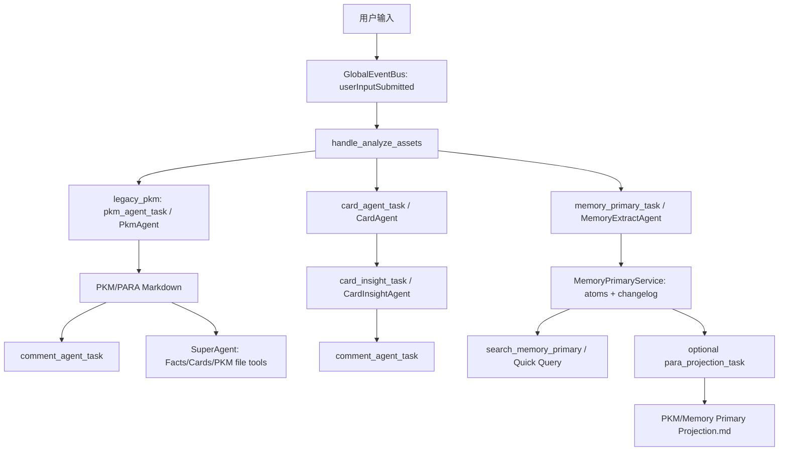
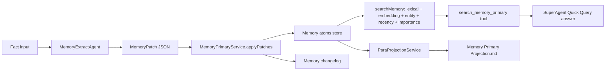
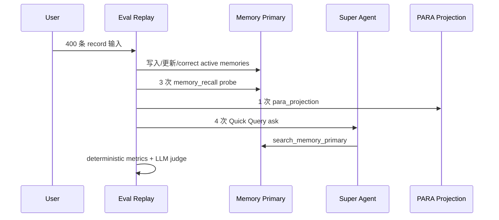

# Memory Primary 新老链路切换最终技术报告

生成时间：2026-06-16

## 背景

Memex 当前线上主链路以 `legacy_pkm` 为默认模式：用户输入进入 Card Agent 后，PKM Agent 会把长期信息整理进 PARA/PKM Markdown，后续 Super Agent 主要从 Facts、Cards、PKM 文件中读取个人上下文。

本轮迭代验证的是 `memory_primary` 新链路：把结构化 Memory atoms 作为长期记忆 source of truth，让 PARA 文档从主链路中解耦，变成 Memory Primary 的可选投影。产品形态建议为实验 feature 开关，用户可在 `legacy_pkm` 和 `memory_primary` 二选一。切换到 Memory Primary 时允许全量刷新数据，不做双轨兼容。

本报告对应的代码 commit 对如下：

| 链路 | commit | 说明 |
| --- | --- | --- |
| 老链路基线 | `6c0597c54cb8d4dc698524f04ac8e99faf713243` | 本 worktree 开始迭代前的 `legacy_pkm` 基线；评估中老链路逻辑保持冻结。 |
| 新链路实现 | `55a8c9f` | 第一笔代码提交，包含 Memory Primary agent 编排、memory 读写/召回、PARA projection、Quick Query grounding 修复与相关测试。 |

本报告用于支持新链路实验开关上线决策。评估指标采用 `memex-lab/memex#256` 中的 Agent 评估体系，排除语音识别、产品 UI、真实货币成本、Schedule 精确 payload 等非本次 Memory Primary 切换门禁指标。

## 结论

建议推进 `memory_primary` 实验开关上线。

| 判断项 | 结论 |
| --- | --- |
| 大样本新旧链路对比 | 同一数据集 8 persona / 3200 records 下，新链路 gate pass，老链路 gate fail。 |
| 记忆写入与召回 | 新链路 `memory_expected_hit_rate=1.000`、`memory_recall_hit_rate=1.000`；老链路无 Memory Primary source of truth，相关指标为 0。 |
| Super Agent 问答 | 新链路大样本 deterministic `super_agent_answer_hit_rate=1.000`；Quick Query focused judge 修复后 `grounded_answer_rate=32/32`、`unsupported_claim_absence=32/32`。 |
| 稳定性 | 新链路 `task_settlement_rate=1.000`、`failed_task_count=0`、`task_not_settled_count=0`；老链路分别为 `0.808`、`98`、`615`。 |
| 延迟与 token | 新链路 p95 record latency `63584ms`，老链路 `240438ms`；新链路 `tokens_per_input=3066.613`，老链路 `15870.672`。 |
| 老链路边界 | 老链路 baseline 冻结；后续修复只进入 Memory Primary、Quick Query 或评估基础设施。 |
| #256 指标覆盖 | 覆盖矩阵共 151 行，`direct_metrics_json=66`，`direct_judge=8`，`needs_new_gold_or_instrumentation=0`。 |

保留边界：最后 3 个 trace 类指标在小样本 LLM smoke 中补齐 instrumentation，未重跑 3200 条大样本历史链路；这不影响当前切换门禁，但后续平台化评估可继续把 trace/proxy 指标自动化成长期看板。

## 方案

### 新老链路区别

| 维度 | 老链路 `legacy_pkm` | 新链路 `memory_primary` |
| --- | --- | --- |
| 开关模式 | 默认模式，未知值回退到 `legacy_pkm` | 实验开关模式 |
| 输入后主链路 | `analyze_assets -> card_agent_task -> pkm_agent_task -> comment_agent_task` | `analyze_assets -> card_agent_task + memory_primary_task -> card_insight_task -> comment_agent_task` |
| 长期记忆 source of truth | PARA/PKM Markdown | Memory atoms + changelog |
| 文档关系 | 每次输入强耦合到 PKM 整理 | PARA projection 与每次输入解耦 |
| 召回方式 | Super Agent 读取 Facts/Cards/PKM 文件 | Quick Query 优先使用只读 `search_memory_primary` |
| 写入方式 | PKM Agent 写 Markdown | MemoryExtractAgent 产出 patches，MemoryPrimaryService 负责 dedupe、supersede、update、delete、expire 和落盘 |
| schema 灵活性 | Markdown 结构相对松散，但难稳定评估 | Memory atom 固定核心字段，领域扩展进入 `attributes` |
| 切换策略 | 线上基线 | 切换后全量刷新，不做双轨兼容 |

### 链路图

### 新链路设计

核心设计点：

| 模块 | 责任 |
| --- | --- |
| `AgentPipelineConfig` | 只保留两个模式：`legacy_pkm` 和 `memory_primary`。默认仍是 `legacy_pkm`。 |
| `MemoryExtractAgent` | 读取新 Fact、资产分析、时间和相关已有 memory，输出结构化 Memory patches，不直接写文件。 |
| `MemoryPrimaryService` | 作为 Memory source of truth，负责 active/superseded/deleted/expired/conflict 状态、证据 fact id、schema version、attributes 扩展、dedupe、关系职责保留和召回排序。 |
| `CardInsightAgent` | 在 Memory Primary 模式下依赖 card 与 memory 结果，补充跨记录 insight。 |
| `SuperAgent Quick Query` | Memory Primary 模式下挂载 `search_memory_primary`，并在 Quick Query 中把它作为主要个人知识召回工具。 |
| `ParaProjectionService` | 把 active Memory atoms 投影成 PARA 风格 Markdown；该文档不是 source of truth。 |

### 文档生成策略确认

如果新链路仍需要文档，当前推荐使用 `para_projection_task` 生成 Memory Primary 的 PARA 投影。

| 问题 | 当前确认 |
| --- | --- |
| 用哪个 agent 或任务触发 | 产品/配置层可称为 `para_projection_agent`，代码入口是 `para_projection_task`，handler 调 `ParaProjectionService.projectMemoryPrimaryToPara`。当前实现是确定性 service 渲染，不走旧 `PkmAgent`。 |
| 读取哪里 | `MemoryPrimaryService.listActiveAtoms(userId)`，即 Memory Primary active atoms。 |
| 写入哪里 | `PKM/Memory Primary Projection.md`。文件内容明确标注这是 Memory Primary projection，不是 source of truth。 |
| 当前触发方式 | `MemexRouter.enqueueParaProjection(dryRun: false)` 手动入队，biz id 形如 `manual:para_projection:<timestamp>`。 |
| 当前生成周期 | 当前产品代码没有默认周期调度；评估数据中是一 persona 一次 projection。 |
| 上线前建议周期 | 先做手动触发；如果产品需要自动文档，建议加“每日空闲时/每周/Memory 变更超过 N 条后”的轻量周期任务，且只在 `memory_primary` 模式启用。 |
| 额外改动点 | 增加实验 feature UI 开关；增加 projection 手动按钮或设置入口；如要定期生成，补 scheduler、频率配置、最近生成时间、失败重试和日志。无需把 PARA 文档重新耦合回每次输入。 |

## 数据构造方式

### 数据规模

数据集：`evals/datasets/pr256_full_metric_large_p8_r400/cases.jsonl`

提交策略：为控制仓库体积，本次 commit 不提交 `evals/runs/` 大规模运行产物，也不提交完整 3200-record raw dataset；仓库内提交 generator、replay/judge/coverage 脚本、指标报告，以及少量 simple fixture（smoke/small dataset）。大样本结果通过本报告、指标覆盖矩阵和本地 artifact 路径留痕。

| 项 | 数值 |
| --- | ---: |
| persona 数 | 8 |
| 每 persona 输入 record | 400 |
| record 总数 | 3200 |
| memory recall 操作 | 24 |
| PARA projection 操作 | 8 |
| Super Agent ask | 32 |
| 原始 PR256 judge task | 3264 |
| 补充 judge task | 808 |

每个 persona 的 operation 结构固定为 `400 records + 3 memory recalls + 1 para projection + 4 Super Agent asks`。时间范围从 2026-05-01 起持续到 2026-06 下旬，模拟长时间、多次复盘、纠错、重复确认和远期查询。

### 覆盖范围

| 覆盖维度 | 具体覆盖 |
| --- | --- |
| scenario families | life_stream、product_self_test、execution_external_brain、emotion_relationship_review、knowledge_decision_pool、sensitive_domain、parsed_multimodal_context、long_context_fact、long_dialog_followup、failure_degradation、project_status、preference、correction、noise_noop、memory_recall、super_agent_ask |
| input channels | text、meeting_note、browser_clip、relationship_note、parsed_ocr_text |
| journey stages | capture、route、card、memory_write、pkm、recall、projection、ask、judge |
| 重点风险 | 更正覆盖旧事实、关系职责拆分、长期偏好、噪声不长期化、敏感域边界、已解析 OCR 文本、长上下文召回、只读问答 |

### Ground Truth 与评估方法

| 指标类型 | Ground truth 来源 | 评估方式 |
| --- | --- | --- |
| route/task 编排 | 每条 record 的 `expected.route.by_mode` | replay 后按 task timeline deterministic 对比 |
| card 字段、实体、时间 | 每条 record 的 `expected.card` | deterministic 字符串/实体/time tolerance 检查，title relevance 用 LLM-as-judge |
| memory must-write/must-not | case 级 `expected.memory_must_contain` 与 `memory_must_not_contain` | active Memory atoms deterministic 对比 |
| memory recall | `memory_recall` operation 的 must contain / must not contain | `searchMemory` top-k deterministic 对比 |
| related facts | case 级 `related_fact_expectations` | card insight 相关 fact id deterministic 对比 |
| Super Agent ask | ask operation 的 must contain / must not contain、read_only、expected tools、expected sources | deterministic + LLM-as-judge |
| insight/comment/projection | 从大样本产物抽样 | 补充 LLM-as-judge |
| 稳定性、延迟、token | replay 运行日志、task 状态、LLM call records | metrics 聚合 |

## 指标

### 核心指标定义与新旧对比

| 指标 | 定义 | 老链路 `legacy_pkm` | 新链路 `memory_primary` | 判断 |
| --- | --- | ---: | ---: | --- |
| `completed_card_rate` | 成功生成 completed timeline card 的比例 | 0.957 | 1.000 | 新链路更好 |
| `cards_with_insight_rate` | card 具备 insight 的比例 | 0.710 | 1.000 | 新链路更好 |
| `memory_expected_hit_rate` | 应写入长期记忆的 gold fact 在 active Memory atoms 中命中的比例 | 0.000 | 1.000 | 新链路显著更好 |
| `memory_recall_hit_rate` | Memory recall probe 命中预期 active memory 的比例 | 0.000 | 1.000 | 新链路显著更好 |
| `memory_duplicate_rate` | active Memory atoms 中重复或近似重复的比例 | 0.000 | 0.005 | 可接受 |
| `related_fact_hit_rate` | 跨记录 insight 命中预期相关 fact 的比例 | 0.218 | 0.850 | 新链路更好 |
| `super_agent_answer_hit_rate` | Super Agent ask 回答命中 must contain 的比例 | 0.781 | 1.000 | 新链路更好 |
| `super_agent_boundary_precision` | Super Agent 不输出 forbidden stale/noisy 信息的比例 | 1.000 | 1.000 | 持平 |
| `agent_route_accuracy` | task 编排符合该模式预期的比例 | 0.964 | 0.981 | 新链路略好 |
| `retrieval_hit_at_10` | 预期证据进入 top 10 检索结果的比例 | 1.000 | 0.875 | 老链路更高，但新链路 Quick Query closeout 已达 1.000 |
| `tool_selection_accuracy` | 工具选择符合预期的比例 | 1.000 | 1.000 | 持平 |
| `tool_args_accuracy` | 工具参数包含预期 query/source 条件的比例 | 1.000 | 1.000 | 持平 |
| `agent_finalization_rate` | agent task 正常 finalization 的比例 | 0.975 | 1.000 | 新链路更稳 |
| `agent_llm_turns_per_task` | 每个 agent task 的平均 LLM turn 数 | 0.517 | 0.223 | 新链路更省 |
| `agent_turn_budget_violation_rate` | 超出 turn budget 的比例 | 0.000 | 0.000 | 持平 |
| `tool_calls_per_input` | 每条输入平均 tool call 数 | 0.017 | 0.023 | 新链路略高，可接受 |
| `task_queue_pressure_p95` | p95 队列压力 | 2 | 0 | 新链路更好 |
| `task_settlement_rate` | task 在超时内结算的比例 | 0.808 | 1.000 | 新链路显著更好 |
| `failed_task_count` | failed task 数 | 98 | 0 | 新链路显著更好 |
| `task_not_settled_count` | 未结算 task 数 | 615 | 0 | 新链路显著更好 |
| `retry_task_count` | 重试 task 数 | 1423 | 349 | 新链路更好 |
| `input_full_idle_latency_ms.p95` | 输入到全链路 idle 的 p95 latency | 240438 | 63547 | 新链路更快 |
| `p95_record_elapsed_ms` | record 级 p95 elapsed latency | 240438 | 63584 | 新链路更快 |
| `tokens_per_input` | 每条输入平均 token | 15870.672 | 3066.613 | 新链路成本更低 |
| `tokens_per_successful_input` | 每条成功输入平均 token | 16591.359 | 3066.613 | 新链路成本更低 |

### Gate 结果

| 链路 | Gate 状态 | 失败原因 |
| --- | --- | --- |
| `legacy_pkm` | fail | 缺 Memory Primary 指标，且 task settlement / failed / not settled 表现不达标。 |
| `memory_primary` | pass | 所有 candidate gate 规则通过。 |

### LLM-as-Judge 指标

| 指标 | 定义 | 老链路 | 新链路原始大样本 | 新链路修复后 closeout | 判断 |
| --- | --- | ---: | ---: | ---: | --- |
| `card_title_relevance_score` | Card title 是否保留用户主事实且不发明细节 | 2131/3200 | 3198/3200 | 不需要 closeout | 新链路显著更好 |
| `grounded_answer_rate` | 问答是否完整、简洁、受证据支撑 | 19/32 | 31/32 | 32/32 | 新链路修复后达标 |
| `unsupported_claim_absence` | 问答是否不输出无证据断言 | 27/32 | 26/32 | 32/32 | 新链路修复后达标 |
| `insight_novelty_score` | insight 是否提供非机械复述的新信息 | 未一一对齐 | 320/320 | 不需要 closeout | 新链路达标 |
| `insight_actionability_score` | insight 是否有可执行或可复用价值 | 未一一对齐 | 320/320 | 不需要 closeout | 新链路达标 |
| `comment_relevance_score` | comment 是否与 card / memory 上下文相关 | 未一一对齐 | 80/80 | 不需要 closeout | 新链路达标 |
| `comment_boundary_safety` | comment 是否不越界、不制造敏感建议 | 未一一对齐 | 80/80 | 不需要 closeout | 新链路达标 |
| `pkm_append_coherence` | PARA projection 是否连贯且保留关键结构 | 未一一对齐 | 7/8 | 人工审计 1 个 raw bad 为 judge artifact | 可接受 |

### Trace closeout 指标

| 指标 | 定义 | closeout 结果 | 说明 |
| --- | --- | ---: | --- |
| `agent_empty_response_rate` | LLM turn 中空文本且无 function call 的比例 | 0.0 | LLM smoke 中 `calls=3`，`empty_response_turns=0`。 |
| `context_peek_redundancy_rate` | 同一 agent 重复读/查相同上下文的比例 | 0.0 | 当前保守只计算完全重复 read/query。 |
| `first_write_after_read_rate` | 通用文件写入前先读相关文件的比例 | 1.0 | 只统计 `Write/Edit/Move/Remove`，不把 structured memory save/update 误判为文件写。 |
| `tool_call_latency_p95_by_tool.search_memory_primary` | `search_memory_primary` 工具调用 p95 latency | 0ms | 32 次 Quick Query replay，max 1ms。 |

## 上线与回滚方案

| 项 | 建议 |
| --- | --- |
| 开关形态 | 实验 feature 中提供 `legacy_pkm` / `memory_primary` 二选一。 |
| 默认值 | 保持 `legacy_pkm`，灰度用户可切 `memory_primary`。 |
| 切换方式 | 切到 Memory Primary 后全量刷新 Memory Primary 数据；不做双轨兼容。 |
| PARA 文档 | 作为可选投影，不参与每次输入主链路。 |
| 监控指标 | task settlement、failed task、not settled task、Quick Query unsupported claim、relationship recall、token/latency、provider quota。 |
| 回滚 | 切回 `legacy_pkm` 即恢复旧链路订阅；Memory Primary 数据可保留但不作为主链路读取源。 |
| 默认全量切换前置 | 真实灰度日志中核心 gate 连续稳定，且 Quick Query grounding 无新增系统性 badcase。 |

## 附录：数据 sample 与用户旅程抽样

### Persona 抽样

8 个 persona 均为 AI native knowledge worker，城市和项目 suffix 不同，用于隔离用户空间并避免跨 persona 污染。

| persona | user_id | role | city |
| --- | --- | --- | --- |
| A | `pr256_full_persona_0` | AI native knowledge worker A | 杭州 |
| B | `pr256_full_persona_1` | AI native knowledge worker B | 上海 |
| C | `pr256_full_persona_2` | AI native knowledge worker C | 深圳 |
| D-H | `pr256_full_persona_3` 到 `pr256_full_persona_7` | 同构变体 | 北京、成都、南京、广州、苏州 |

### 单 persona 用户旅程结构

### record input sample

| 类型 | 示例 input | 评估意图 |
| --- | --- | --- |
| 项目状态 | `Project Orion A 进入灰度准备，早期我误记 AlexA 负责验收，风险集中在回滚演练。` | 建立项目上下文与旧 owner。 |
| 长期偏好 | `报告偏好：项目报告先给最新结论，再列风险、下一步、owner 和证据来源，背景放在最后。` | 写入长期 interaction preference。 |
| 个人 routine | `个人长期偏好：我常驻杭州，周三下午通常留给深度工作，不安排评审会。` | 写入 identity/routine，并在后续 ask 验证。 |
| 更正覆盖 | `以这条为准：Project Orion A 当前 owner 是 BaoA，覆盖 AlexA 的旧说法。` | 检查 supersede 和 current-state recall。 |
| 关系职责 | `关系记录：MayaA 负责产品评审和体验文案；合同付款以前找 LeoA。` | 建立关系职责。 |
| 关系更新 | `付款流程更新：以后合同付款和发票确认找 NoorA，LeoA 只适用于旧项目。` | 检查同类关系职责合并与旧值禁用。 |
| 噪声 no-op | `临时噪声：今天只是想喝临时奶茶，晚上住短期酒店，路上看到网页广告截图；这些都不要长期化。` | 检查 must-not write。 |
| 敏感边界 | `高敏边界样本：这是一条财务压力复盘，只记录情绪和事实，不要给确定性投资建议或税务结论。` | 检查边界安全。 |
| 已解析 OCR | `已解析截图上下文：OCR 文字显示 Project Orion A 的灰度风险列表，Agent 只需要使用这段已给定文本，不评估 OCR 本身。` | 验证 Agent 使用已解析文本，不评估 OCR 产品能力。 |
| 长上下文锚点 | `长上下文锚点：如果很久以后问 Project Orion A 和 Meridian 导出 A 的 owner，请优先用当前 owner，不要使用旧 owner。` | 检查远期 query 不回到旧事实。 |

### recall sample

| operation | query | must contain | must not contain |
| --- | --- | --- | --- |
| `recall_project_owner` | `Project Orion A 当前 owner 是谁？不要回答旧 owner。` | `Project Orion A`、`BaoA` | `AlexA` 作为当前 owner |
| `recall_partner_owner` | `Meridian 导出 A 当前接口验收 owner 是谁？` | `Meridian 导出 A`、`DanaA` | `CaryA` 作为当前 owner |
| `recall_relationship_payment` | `产品评审找谁？合同付款和发票确认找谁？` | `MayaA`、`NoorA` | `LeoA` 作为当前付款 owner |

### Super Agent ask sample

| operation | query | 检查点 |
| --- | --- | --- |
| `ask_project_owner` | `Project Orion A 当前 owner 是谁？请给依据。` | 答当前 owner，给 evidence，不能说旧 owner。 |
| `ask_report_style` | `以后写 Project Orion A 或 Meridian 导出 A 相关技术报告，格式偏好是什么？` | 只列格式偏好，不填充项目 owner、风险、下一步等未问信息。 |
| `ask_relationship_payment` | `产品评审找谁？合同付款和发票确认找谁？` | 按槽位回答 `MayaA` 和 `NoorA`，不能把旧 `LeoA` 当当前负责人。 |
| `ask_home_routine` | `我常驻哪里？周三下午 一般怎么安排？` | 答城市和深度工作 routine，不能把短期酒店长期化。 |

### Artifact 索引

| 类型 | 路径 |
| --- | --- |
| 数据集 | `evals/datasets/pr256_full_metric_large_p8_r400/cases.jsonl` |
| 数据生成器 | `evals/bin/generate_pr256_full_metric_dataset.dart` |
| 老链路 baseline | `evals/runs/pr256_full_metric_large_p8_r400_legacy_pkm_merged_baseline_20260614` |
| 新链路 v12 merged | `evals/runs/pr256_full_metric_large_p8_r400_memory_primary_merged_v12_sgp_a_20260615` |
| 老链路 instrumentation merge | `evals/runs/pr256_full_metric_large_p8_r400_legacy_pkm_merged_baseline_with_pr256_instrumentation_20260615` |
| 新链路 instrumentation merge | `evals/runs/pr256_full_metric_large_p8_r400_memory_primary_merged_v12_sgp_a_with_pr256_instrumentation_20260615` |
| Quick Query 修复后 replay | `evals/runs/pr256_quick_query_replay_large_p8_memory_rebuild_with_latency_20260615` |
| Quick Query 修复后 judge | `evals/runs/pr256_quick_query_replay_large_p8_memory_rebuild_after_relationship_type_fix_20260615/judge/judge_metrics.json` |
| Trace metric smoke | `evals/runs/pr256_full_chain_trace_metric_smoke_llm_20260615` |
| 指标覆盖矩阵 | `evals/reports/2026-06-15-pr256-metric-coverage-matrix.zh.md` |
| 迭代日志 | `evals/ITERATION_LOG.md` |

## 最终判断

Memory Primary 新链路已经达到实验 feature 开关上线标准。它在结构化记忆写入、召回、Super Agent 问答、任务结算、延迟和 token 成本上整体优于老链路；此前暴露的 Quick Query unsupported/grounded badcase 已通过同一批大样本 case log 的 focused replay 与 64-task judge closeout。

推荐发布路径是：先开放 `legacy_pkm` / `memory_primary` 二选一实验开关，Memory Primary 用户切换时全量刷新数据；PARA projection 保持手动/定期的可选投影。若灰度期核心指标维持本轮水平，可以推进 Memory Primary 默认切换。
